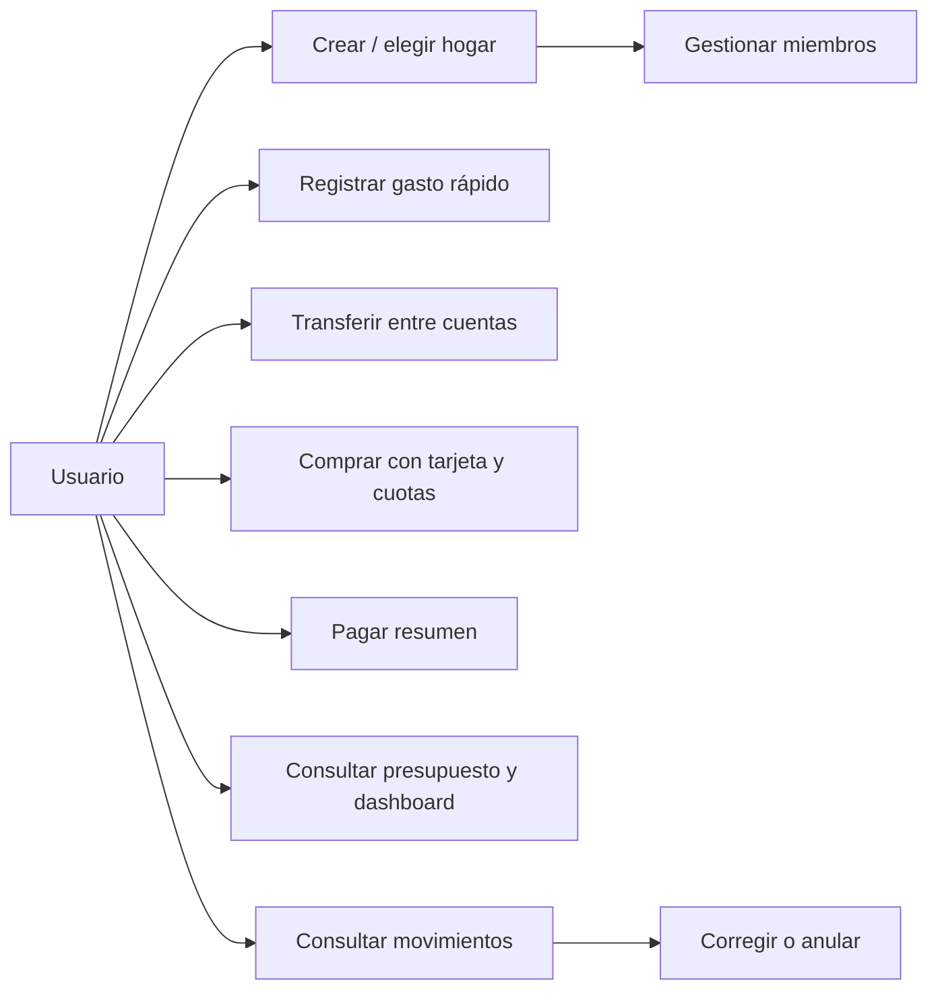

# 03 · Casos de uso

## Actores y precondiciones

- Visitante: no autenticado; Usuario: autenticado; Titular/Administrador/Miembro/Cargador: usuarios con membresía en hogar.
- Servicio programado: crea recordatorios/ocurrencias en fases posteriores; Operador: administra plataforma sin consultar contenido financiero normalmente.

## Catálogo

| ID | Caso | Actor | Requisitos |
|---|---|---|---|
| CU-01 | Registrarse e iniciar sesión | Visitante | RF-001 |
| CU-02 | Crear hogar | Usuario | RF-002 |
| CU-03 | Invitar miembro y asignar permisos | Titular/Admin | RF-003,004 |
| CU-04 | Seleccionar hogar activo | Miembro | RF-005 |
| CU-05 | Registrar gasto rápido | Miembro autorizado | RF-008,018 |
| CU-06 | Registrar transferencia | Miembro autorizado | RF-009 |
| CU-07 | Revisar, filtrar, corregir y anular movimientos | Miembro autorizado | RF-010,011,020 |
| CU-08 | Configurar tarjeta | Titular/Admin | RF-012 |
| CU-09 | Crear compra en cuotas | Miembro autorizado | RF-013,015 |
| CU-10 | Pagar tarjeta | Miembro autorizado | RF-014,017 |
| CU-11 | Gestionar presupuesto y analizar dashboard | Miembro autorizado | RF-016,017 |
| CU-12 | Revisar cierre diario | Miembro | RF-023 (V1) |

## CU-02 · Crear hogar

**Pre:** usuario autenticado. **Flujo:** 1) elige crear hogar; 2) ingresa nombre; 3) servidor valida; 4) crea Household y Membership titular en una transacción; 5) activa hogar; 6) abre onboarding. **Alternativas:** nombre vacío → validación 400; error de BD → rollback. **Post:** hogar aislado, usuario titular. **Aceptación:** no se crean hogares huérfanos.

## CU-03 · Invitar miembro

**Pre:** membresía activa y permiso `member.invite`. **Flujo:** crea invitación temporal para email y rol permitido; se entrega vínculo; invitado se autentica y acepta; se consume token; se crea membresía única. **Alternativas:** expirado, ya usado, ya miembro, rol no concedible, invitación revocada. **Post:** permisos vigentes solo para el hogar invitante.

## CU-05 · Registrar gasto rápido

**Pre:** miembro con permiso `transaction.create`, categoría y cuenta accesibles. **Flujo:** abre acción rápida; ingresa importe; selecciona o acepta categoría/cuenta sugerida; confirma; API valida tenant, decimal y fecha; persiste gasto con `idempotency_key`; actualiza vista con confirmación. **Alternativas:** cuenta archivada → error; doble toque → mismo registro; sin conexión → mensaje claro (sin prometer sincronización MVP). **Post:** un solo gasto impacta saldo y presupuesto. **Aceptación:** interfaz móvil en 360 px y sin duplicados por retry.

## CU-06 · Transferencia

**Pre:** cuentas activas y de la misma moneda y hogar (MVP). **Flujo:** elige cuenta origen/destino y monto; valida fondos según política de saldos negativos; registra evento único y sus dos efectos. **Alternativa:** cuenta externa → rechazo; mismo origen/destino → rechazo. **Post:** suma de patrimonio de esas cuentas no cambia.

## CU-07 · Corregir o anular movimiento

**Pre:** permiso correspondiente. **Flujo:** búsqueda, selección, edición de campos admitidos o anulación; se registra antes/después y actor; saldos y agregados se recalculan. **Alternativa:** movimiento ligado a cuotas o resúmenes requiere operación específica de reversión. **Post:** no quedan registros contables incoherentes.

## CU-09 · Comprar en cuotas

**Pre:** tarjeta activa del hogar. **Flujo:** especifica fecha, total, cantidad de cuotas y categoría; sistema calcula fechas de imputación por ciclo y redondeos; confirma; persiste compra y plan asociado atómicamente. **Alternativas:** cuotas <=0, monto inválido o error de calendario → rechazo. **Post:** consumo reconocido una vez; obligaciones futuras consultables.

## CU-10 · Pagar tarjeta

**Pre:** obligación pendiente, cuenta de pago válida y autorización. **Flujo:** selecciona tarjeta y período, monto y cuenta; confirma pago; sistema registra salida de fondos y reducción de obligación; no genera nuevo gasto. **Alternativas:** pago parcial, exceso, repetición, reversión → aplican reglas explícitas del ledger. **Post:** balance no duplica consumo.

## CU-11 · Dashboard y presupuestos

**Pre:** membresía activa. **Flujo:** define límites por categoría y mes; consulta KPI gastos/ingresos/balance, comparativa y progreso; filtra período y cuentas visibles. **Alternativa:** datos insuficientes → estados vacíos sin dividir por cero. **Post:** sumas coinciden con libro de movimientos y reglas RN-002,003,008.

## CU-12 · Cierre diario (V1)

Propone resumen del día, agrega olvidos, marca revisado; los registros continúan siendo editables con auditoría.
