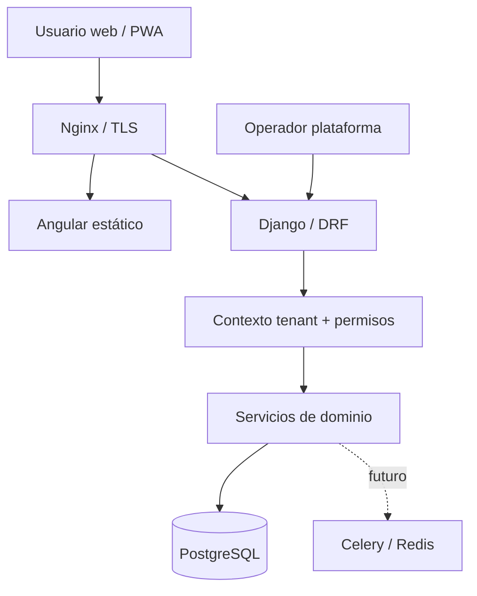

# 04 · Arquitectura técnica

## Decisión arquitectónica

**Monolito modular en monorepo**, no microservicios. Backend único Django/DRF, frontend Angular separado para build/deploy, PostgreSQL compartido con aislamiento por hogar. Celery/Redis solo para tareas que realmente lo requieran.



## Estructura sugerida del repo

```text
Gastio/
  backend/
    config/{settings,urls,asgi,wsgi}.py
    apps/{identity,households,accounts,categories,transactions,cards,budgets,reports,audit}/
    tests/
    manage.py
    pyproject.toml
  frontend/
    src/app/{core,shared,features,layouts}/
    public/
    package.json
  docs/
  infra/{nginx,systemd}/
  scripts/
  .env.example
  README.md
```

Las apps de dominio tendrán serializers/API, servicios de caso de uso, selectores/queries, modelos y pruebas. Evitar lógica de negocio repartida entre vistas, señales y plantillas. Usar transacciones atómicas en escrituras complejas.

## Tenancy

`Household` representa tenant. `Membership(user, household, role, status)` permite N:M. Los objetos propios de hogar llevan `household_id` no nulo, y los endpoints son `/api/v1/households/{household_id}/...`. Un servicio de autorización resuelve membresía activa **antes de** buscar objetos, y filtra `household_id` en toda consulta. Validar que cada FK relacionada pertenece al mismo tenant; no basta con filtrar el recurso raíz. Considerar PostgreSQL RLS como defensa adicional en una fase posterior, no como sustituto de la autorización.

## Roles iniciales

| Permiso | Titular | Admin hogar | Miembro | Carga limitada |
|---|---|---|---|---|
| Editar hogar y miembros | Sí | Sí (salvo transferir titular) | No | No |
| Crear movimientos | Sí | Sí | Sí | Sí, cuentas autorizadas |
| Ver reportes generales | Sí | Sí | Sí | No |
| Editar movimientos ajenos | Sí | Sí | No, salvo permiso explícito | No |
| Administrar tarjetas/presupuestos | Sí | Sí | Consulta | No |

La matriz es baseline para implementación; acceso a cuentas privadas y granularidad por cuenta son ADR pendientes. Aplicar denegación por defecto.

## Datos financieros

Separar `Transaction` como evento de negocio y `LedgerEntry` como afectación de saldo/deuda (o diseño equivalente de libro mayor). Una compra con tarjeta crea gasto + obligación, pago de tarjeta reduce cuenta líquida + deuda y transferencia mueve entre cuentas, sin crear consumo adicional. Definir modelo contable exacto antes de migraciones definitivas.

## Despliegue

Desarrollo con servicios locales documentados. Producción compatible con VPS Fedora, Nginx, Gunicorn, PostgreSQL y opcional Redis. Compilar frontend fuera del VPS y transferir assets si se mantiene política de no instalar Node en servidor. Health/readiness, migraciones explícitas, STATIC_ROOT y copias cifradas. Secretos solo en entorno/gestor externo.

## Observabilidad

Request ID + user ID + household ID (sin datos sensibles), métricas de latencia, errores por endpoint, backups y alertas de caída. Redactar PII/montos/notas en logs.

## ADR pendientes

- ADR-001: nombres/roles finales y privacidad por cuenta.
- ADR-002: ledger definitivo y algoritmo exacto de ciclo de tarjeta/cierre/vencimiento.
- ADR-003: autenticación SPA (cookies/sesión vs tokens) y estrategia CSRF.
- ADR-004: modo offline en evolución posterior.
- ADR-005: planes/licenciamiento sin contaminación de dominio financiero.
