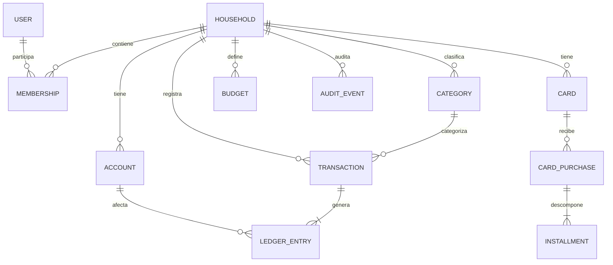

# 05 · Modelo de datos conceptual y lógico inicial

> Modelo propuesto; revisar ADR-002 antes de fijar migraciones de ledger/tarjetas. Todas las FK dentro de un hogar requieren comprobación de pertenencia cruzada.

## Entidades

| Tabla | Campos relevantes | Reglas / índices |
|---|---|---|
| User | id UUID, email único, nombre, locale | Sin atribución exclusiva a hogar |
| Household | id UUID, nombre, base_currency, timestamps | tenant raíz |
| Membership | id, user_id, household_id, role, status, invited_at | unique(user,household); índice user/status |
| Invitation | id, household_id, email, role, token_hash, expires_at, consumed_at | token nunca en claro; expiración |
| Account | id, household_id, name, kind, currency, status, opening_balance | unique(household,name) opcional; índices hogar/estado |
| Category | id, household_id, name, type, parent_id, active | parent mismo hogar; categorías ingreso/gasto |
| Transaction | id, household_id, author_id, type, amount Decimal, currency, effective_date, category_id?, note?, status, idempotency_key, created_at | índice (household,effective_date,id); idempotencia única en ámbito definido |
| LedgerEntry | id, household_id, transaction_id, account_id?, card_id?, amount_signed, currency, entry_type | coherencia de suma/efectos; no escribir fuera de servicio |
| Card | id, household_id, name, brand?, closing_day, due_day, currency, active | validar días y reglas calendario |
| CardPurchase | id, household_id, card_id, transaction_id, installment_count, total_amount | una compra ligada a un gasto |
| Installment | id, household_id, purchase_id, ordinal, amount, cycle_year, cycle_month, due_date, status | unique(purchase,ordinal), sum = total compra |
| CardPayment | id, household_id, card_id, funding_account_id, amount, payment_date, transaction_id | vinculado a reducción de deuda |
| Budget | id, household_id, category_id, year, month, limit_amount, currency | unique(household,category,year,month) |
| AuditEvent | id, household_id, actor_id, action, object_type, object_id, before_json, after_json, created_at | inmutable, acceso limitado |

## Invariantes

- Un objeto asociado al hogar A jamás referencia cuenta/categoría/tarjeta del hogar B.
- Importes de operación `DECIMAL(18,2)` para ARS en MVP, con capa de precisión por moneda antes de soportar otras divisas; no usar floats.
- No borrar en cascada libros financieros históricos cuando se desactiva un usuario/cuenta/categoría.
- `opening_balance` es condición inicial, no se trata como ingreso operativo del período.
- Fecha efectiva (negocio) y fecha de creación (auditoría) son distintas.
- Compra, cuotas y entries se guardan atómicamente; no confiar en cálculos de frontend.
- Las operaciones de revocación y reversión se trazan; no borrar silenciosamente.

## Estados y reglas temporales

Transaction: `posted|voided` (extensible). Membership: `active|revoked`. Invitation: derivado de timestamps de expiración/consumo/revocación. Installment: `scheduled|paid|cancelled` (pago parcial requiere modelo de asignación explícito). Ciclos de tarjetas se calculan por fecha local del hogar, y días que exceden el mes se ajustan por política documentada.

## Migraciones iniciales por fase

1. Identidad y hogares.
2. Cuentas y categorías.
3. Transacciones y ledger.
4. Tarjetas, compras, cuotas y pagos.
5. Presupuestos, reportes y auditoría.
