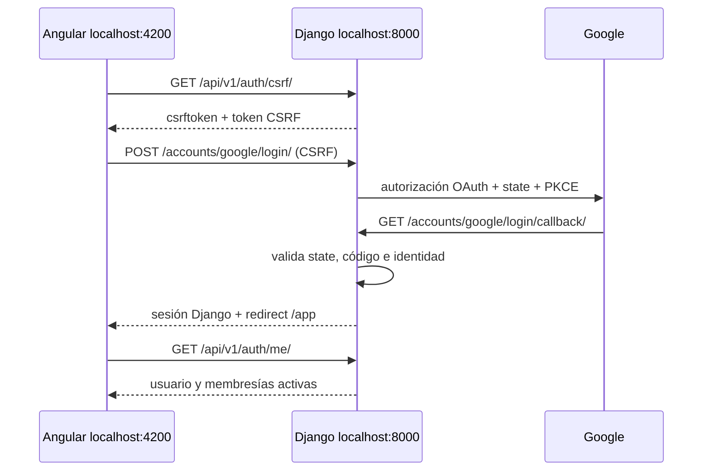

# 08 · Google OAuth 2.0 / OpenID Connect

## Decisión

Gastio usa `django-allauth` 65.x con el flujo web OAuth 2.0 de Google y la sesión de Django. Se evaluó Allauth Headless, pero no se activa: el cliente es una SPA que usa el navegador y cookies de sesión `HttpOnly`, por lo que un flujo web con redirecciones evita introducir tokens de sesión o JWT en Angular. No hay tokens en `localStorage` ni `sessionStorage`.



## Configuración local

Instalar dependencias y migrar (Allauth aporta migraciones de `sites`, `account` y `socialaccount`):

```bash
./scripts/setup.sh
set -a; source .env; set +a
.venv/bin/python backend/manage.py migrate
./scripts/dev-start.sh
```

Agregar al `.env`, sin comillas ni valores versionados:

```dotenv
GOOGLE_OAUTH_CLIENT_ID=...
GOOGLE_OAUTH_CLIENT_SECRET=...
GASTIO_FRONTEND_URL=http://localhost:4200
```

Si falta cualquiera de las dos credenciales, `GET /api/v1/auth/config/` responde solamente `{"googleLoginEnabled": false}` y el botón queda deshabilitado. No se almacenan credenciales en `SocialApp` ni en la base de datos.

En Google Cloud crear un cliente OAuth de tipo **Aplicación web**, completar la pantalla de consentimiento y, mientras el proyecto esté en Testing, agregar los usuarios de prueba. Para el entorno local configurar:

- Origen JavaScript autorizado: `http://localhost:4200`.
- URI de redireccionamiento autorizada: `http://localhost:8000/accounts/google/login/callback/`.

El callback debe coincidir exactamente, incluyendo `localhost` (no `127.0.0.1`), puerto, ruta y barra final. Para producción se deben definir `GASTIO_FRONTEND_URL`, hosts, orígenes CORS y `CSRF_TRUSTED_ORIGINS` reales de HTTPS antes del despliegue; no se documenta un dominio ficticio.

## Endpoints

| Método | Ruta | Uso |
|---|---|---|
| GET | `/api/v1/auth/config/` | Indica si Google está configurado, sin filtrar secretos. |
| GET | `/api/v1/auth/csrf/` | Entrega y fija el token CSRF para mutaciones. |
| POST | `/accounts/google/login/` | Inicio OAuth de Allauth; rechaza GET como mecanismo de login. |
| GET | `/accounts/google/login/callback/` | Callback real de Google, validado por Allauth. |
| GET | `/api/v1/auth/me/` | Sesión actual y membresías activas. |
| POST | `/api/v1/auth/active-household/` | Selecciona sólo un hogar cuya membresía activa valida Django. |
| POST | `/api/v1/households/` | Crea explícitamente el primer hogar y membresía `owner` durante onboarding. |
| POST | `/api/v1/auth/logout/` | Cierra sesión Django y requiere CSRF. |

El proxy de desarrollo Angular reenvía `/api` y `/accounts` al backend y preserva el host `localhost:8000`, para que el callback generado por Allauth sea el autorizado por Google. En producción el proxy inverso debe ofrecer el mismo origen lógico o reenviar correctamente el host/protocolo seguro.

## Seguridad y cuentas

- Scopes limitados a `openid`, `email` y `profile`; `access_type=online`, sin refresh token y sin permisos de Gmail, Drive o Calendar.
- PKCE y `state` están habilitados por el proveedor Google de Allauth. La sesión guarda el estado de transacción; no usar sesiones firmadas por cookie.
- Sólo la identidad social estable (`provider=google`, `uid=sub`) reutiliza una cuenta. Un email existente sin esa identidad no se vincula automáticamente y vuelve al login con un error genérico.
- El usuario creado conserva UUID, email/nombre/apellido y contraseña inutilizable. La foto se conserva en `SocialAccount.extra_data.picture`; `/auth/me/` expone `avatarUrl` sólo si es HTTPS de googleusercontent.com. Angular muestra iniciales si falta/falla. `ACCOUNT_USER_MODEL_USERNAME_FIELD=None` corresponde al modelo sin username.
- La sesión autentica; la membresía autoriza. `/auth/me/` expone sólo membresías activas y la selección de hogar se valida en servidor. Un usuario sin hogares va a onboarding; sólo allí puede crear explícitamente el primero y su membresía `owner` en una transacción.
- Desarrollo usa cookies `HttpOnly`, `SameSite=Lax`, `CSRF_TRUSTED_ORIGINS=http://localhost:4200` y allowlist CORS. Producción fuerza HTTPS y cookies `Secure`, y rechaza `DEBUG` y comodines CORS/CSRF.

## Prueba manual y diagnóstico

1. Confirmar que PostgreSQL está disponible y aplicar migraciones.
2. Cargar las dos credenciales de Google y ejecutar `./scripts/dev-start.sh`.
3. Abrir `http://localhost:4200/login`, elegir **Continuar con Google** y autenticar un usuario agregado como tester si corresponde.
4. Comprobar `GET /api/v1/auth/me/` desde la aplicación, recargar la página y luego usar **Cerrar sesión**.

Cancelar consentimiento, state inválido, callback inválido o fallas de proveedor terminan en una respuesta de Allauth sin secretos ni trazas con `DEBUG=False`; el usuario puede volver a intentar. La validación externa completa queda pendiente hasta cargar credenciales reales de Google Cloud. No se realizan llamadas a Google en tests automatizados.
