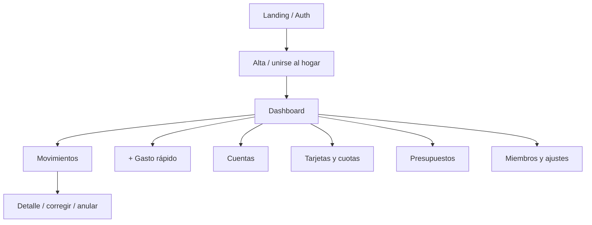

# 08 · UX/UI y navegación

## Dos experiencias en un diseño responsive

**Completa (desktop/tablet):** navegación persistente, tablas, filtros, gráficos y administración. **Rápida (móvil):** acción primaria registrar gasto; teclado numérico optimizado, favoritos, cuenta recordada (por dispositivo/hogar) y confirmación. Es el mismo producto, API y modelo de permisos, no dos apps.

## Mapa de pantallas MVP

## Historias de pantalla

| Pantalla | Componentes | Empty/error state |
|---|---|---|
| Dashboard | ingresos, gastos, balance, presupuestos, obligaciones próximas, evolución | onboarding contextual, períodos sin datos |
| Carga rápida | importe, categoría, cuenta, fecha actual editable, nota opcional, guardar | error por campo y retry seguro |
| Movimientos | listado, filtros fecha/tipo/cuenta/categoría/texto, detalle | sin coincidencias, permisos |
| Cuentas | saldos derivados y detalle | sin cuentas → CTA crear |
| Tarjetas | resumen por ciclo, compras, cuotas, proyección mensual, registrar pago | sin tarjetas, fechas inválidas |
| Presupuestos | límites, barras de uso, exceso sin bloqueo | sin presupuesto → CTA definir |
| Hogar/miembros | selector tenant, invitar, roles, revocar | rol insuficiente → mensaje claro |

## Criterios de interacción

- Navegación lateral estable en escritorio; móvil con barra inferior o menú, CTA de gasto prominente.
- Acceso rápido con máximo 3 decisiones esenciales tras monto; evitar formularios largos.
- No ocultar contexto del hogar: mostrar nombre del hogar activo.
- No codificar significado exclusivamente por color; soporte lectores de pantalla, foco y targets táctiles.
- Mostrar `ARS` junto al monto para evitar confusiones; usar formatos argentinos e ISO internamente.
- Al guardar: botón inhabilitado durante request, toast/confirmación, soporte de idempotencia backend.
- Deshacer/revertir mediante operación auditada, no delete irreversible.
- Preferencias: cuenta/categoría frecuente por usuario-hogar; jamás inferir tenant silenciosamente tras cambiar de hogar.

## PWA MVP

Manifest, iconos finales pendientes de branding, servicio de archivos estáticos con caché segura; **no** cachear endpoints financieros sensibles de otros hogares. Offline transaccional y cola de sync solo en fase futura con diseño de conflictos explícito.
