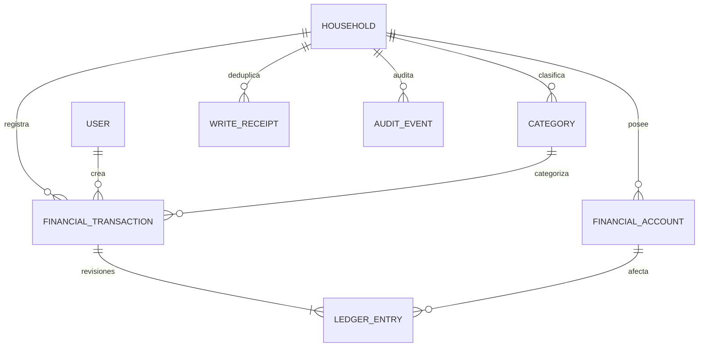

# Fase 1 · Núcleo financiero operativo

Fecha: 2026-10-09. Esta entrega agrupa el núcleo antes previsto para las fases 2/3.
Mantiene las funcionalidades de autenticación Google, sesión, avatar y hogares.

## Auditoría y decisiones

Se revisaron README, ERS, casos de uso, arquitectura, modelo conceptual, API,
seguridad, UX, pruebas, roadmap y estado previo, además de los modelos y rutas.
`accounts.User` es identidad, no cuenta financiera. Por eso las cuentas monetarias
se implementan en `wallets.FinancialAccount`, categorías en `categories`, operaciones
y ledger en `transactions`, evidencia en `audit`. Se reutilizan la sesión Django,
`resolve_active_membership`, membresías, interceptores CSRF y shell Angular.

ADR-001: esta fase habilita exclusivamente cuentas compartidas del hogar. Owner/admin
administran cuentas y categorías y corrigen cualquier movimiento; member consulta
todo lo compartido, registra y corrige/anula sólo lo propio. `limited_entry` no tiene
acceso financiero hasta que exista una asignación explícita de cuentas. No se
implementan cuentas privadas ni se presume acceso a ellas. Se conserva ese requisito
para una futura extensión con ACL y pruebas, sin exponer datos privados.

ADR-002: una operación tiene una revisión actual y un conjunto de entradas inmutables
por revisión. Una corrección crea otra revisión completa, conservando la anterior y
un evento antes/después. El saldo suma sólo entradas de la revisión actual de operaciones
`posted`. La anulación cambia a `voided`, conservando todas las entradas y auditoría.
Esta estrategia ofrece equivalencia a una reversión contable sin entradas destructivas.
Las aperturas son inmutables y separadas de ingresos; saldo inicial cero no genera entrada.
La interfaz acepta aperturas no negativas; saldos posteriores pueden ser negativos.

ADR-003: se conserva OAuth Allauth y sesión/cookie/CSRF. El tenant efectivo se obtiene
de `active_household_id` en sesión y se vuelve a autorizar en cada endpoint. Las rutas
financieras usan `/api/v1/accounts/` etc. en lugar de repetir el hogar en la ruta;
esto cambia el contrato propuesto, no el principio de autorización. Un header opcional
`X-Household-ID` sólo confirma que el hogar de la pantalla sigue siendo el de sesión:
una discrepancia devuelve 409, nunca selecciona ni autoriza otro hogar.

ADR-004/006: negativos permitidos, sin bloquear gastos por fondos insuficientes. ARS
es la única moneda habilitada. La columna currency y la validación de compatibilidad
preparan otra fase; no hay conversión ni suma de monedas diferentes.

## Modelo y garantías



Una entrada para ingreso/apertura (+importe), una para gasto (−importe), dos para
transferencia (−origen/+destino). `Decimal(18,2)`, sin saldo mutable. UUIDs y FKs PROTECT.
La fecha económica determina los KPIs mensuales; la fecha de creación determina
la trazabilidad. Transferencias y aperturas nunca suman ingresos/gastos.

Constraints comprueban importes, tipos, moneda, forma de operación, revisiones y
unicidad. Los triggers PostgreSQL diferidos verifican al commit la cantidad, signos,
importes, cuentas, categoría, tenant, moneda y existencia de auditoría de la revisión.
Triggers adicionales impiden editar/borrar ledger, auditoría y recibos, borrar
operaciones, cambiar tenant/moneda/identidad de categoría o reactivar anulaciones.

Toda escritura compleja es atómica. Se bloquea el hogar con `select_for_update`, y
se bloquea/revalida su membresía para impedir escrituras tras una revocación concurrente.
Es una estrategia deliberadamente sencilla: serializa escrituras del mismo hogar,
pero no de hogares distintos. Revisar contención en un piloto antes de reemplazarla.
El dashboard toma el mismo bloqueo para devolver saldos y KPIs coherentes.

`Idempotency-Key` UUID obligatorio en todas las escrituras financieras. Ámbito:
hogar + actor + clave. El fingerprint incluye acción, recurso y datos normalizados.
Repetición idéntica devuelve la respuesta original (200); otro contenido, 409.
No expiran automáticamente los recibos. Corrección/anulación exige `expected_revision`;
una pantalla desactualizada recibe 409. La UI conserva la clave en un reintento sin
modificar el contenido y bloquea el doble envío. Un cambio de hogar invalida respuestas
tardías y reinicia formularios sin conservar selecciones del hogar anterior.

## API implementada

Todas estas rutas se agregan bajo `/api/v1/`, requieren sesión y membresía activa.
Listas: `{count,next,previous,results}`, 25 por página, `page_size` máximo 100.

| Recurso | Acciones |
|---|---|
| `accounts/` | GET lista, POST alta con `opening_balance` y `opening_date` |
| `accounts/{id}/` | GET detalle, PATCH nombre/tipo/descripción/is_active |
| `categories/` | GET lista, POST alta; slug estable y único por hogar |
| `categories/{id}/` | GET detalle, PATCH nombre/color/is_active |
| `transactions/` | GET lista, POST ingreso/gasto/transferencia |
| `transactions/{id}/` | GET detalle, PATCH corrección auditada |
| `transactions/{id}/void/` | POST anulación auditada |
| `transactions/{id}/history/` | GET auditoría paginada |
| `transfers/` | POST transferencia, mismo motor e idempotencia que transactions |
| `dashboard/summary/?month=YYYY-MM` | GET saldo actual, KPIs del mes, cuentas, distribución y últimos movimientos |

Filtros de movimientos: `from`, `to`, `type`, `account` (incluye destino de transferencia),
`category`, `status`, `search` en descripción. `ordering`: ±effective_date, ±amount,
±created_at con desempate estable. Fechas inválidas, UUIDs inválidos y órdenes
no permitidos dan 400. Filtros siempre se aplican después del tenant.

```json
{
  "type": "expense",
  "amount": "18500.00",
  "account_id": "UUID de cuenta",
  "category_id": "UUID de categoría expense",
  "effective_date": "2026-10-09",
  "description": "Supermercado"
}
```

Para ingresos cambiar `type` y usar categoría income. Para transferencia enviar
`type=transfer`, `destination_id` y ninguna categoría. Para PATCH enviar los campos
que cambian y `expected_revision`. Body no acepta household/user/balance ni campos
ajenos al contrato. DELETE no está habilitado. OpenAPI generado en `/api/v1/schema/`.

## UX y recorrido manual

1. Ejecutar `./scripts/dev-start.sh`, ingresar con Google y elegir un hogar activo.
2. `/app/accounts`: crear Efectivo con apertura 100.000 ARS; crear Banco con apertura 0.
3. `/app/transactions`: registrar ingreso de 20.000 en Efectivo, categoría Sueldo;
   registrar gasto de 10.000, categoría Supermercado. Efectivo queda en 110.000.
4. Registrar transferencia de 50.000 de Efectivo a Banco: saldos 60.000 y 50.000;
   dashboard consolidado 110.000, ingresos 20.000, gastos 10.000, neto 10.000.
5. Corregir gasto a 15.000: saldo consolidado 105.000. Anularlo: saldo 120.000;
   historial conserva alta, corrección y anulación. Transferencia se muestra una vez.
6. `/app/quick`: importe con coma o punto, chip de categoría, cuenta, fecha y nota;
   guardar muestra confirmación, limpia importe y permite continuar en la misma pantalla.
   La selección se mantiene sólo mientras el formulario y hogar sigan abiertos.
7. Filtrar movimientos por cuenta, período, categoría/tipo, descripción y estado;
   ordenar y paginar; abrir Historial para verificar actor y cambios.
8. Archivar una cuenta: no admite operaciones nuevas, conserva saldo e historial;
   se puede reactivar. Desactivar una categoría impide usarla en operaciones nuevas.
9. `/app/categories`: crear/editar categorías. Un member no ve acciones administrativas.
10. Cambiar de hogar: listas/formularios se reinician; un UUID del anterior no permite
    leer ni escribir recursos ajenos. Revocar membresía corta el acceso incluso con sesión.

Los valores anteriores son un guion manual; no se insertan en gastio_db automáticamente.
El dashboard muestra ceros y estados vacíos cuando no hay datos. Las vistas son responsive
con inputs etiquetados, mensajes role=alert/status, botones deshabilitados y targets táctiles.
No hay IA, integración bancaria, tarjetas, presupuestos, FX ni despliegue de producción.

## Migraciones y operación

Migraciones nuevas: wallets.0001; categories.0001/0002; audit.0001;
transactions.0001/0002/0003/0004. La última impide más de una apertura por cuenta
y añadir entradas a revisiones históricas/anuladas. `categories.0002` crea una vez las 18 categorías sugeridas
para hogares existentes; el onboarding las crea atómicamente para hogares nuevos.
No se borra/recrea gastio_db, no se ejecuta flush, no se reinicia PostgreSQL.
La reversión del seed es no-op para no eliminar categorías utilizadas o editadas.
La migración de triggers tiene SQL inverso; no revertir tablas con datos reales sin
un procedimiento específico de conservación y respaldo.

```bash
set -a; source .env; set +a
.venv/bin/python backend/manage.py migrate --noinput
DJANGO_SETTINGS_MODULE=config.settings.test .venv/bin/python -m pytest -c backend/pyproject.toml backend --reuse-db -q
.venv/bin/python backend/manage.py check
.venv/bin/python backend/manage.py makemigrations --check --dry-run
.venv/bin/python backend/manage.py spectacular --validate --fail-on-warn --file /tmp/gastio-openapi.yml
.venv/bin/python -m black --check backend --workers 1
.venv/bin/python -m ruff check backend
npm --prefix frontend test
npm --prefix frontend run lint
npm --prefix frontend run build
```

Los tests usan `config.settings.test` y `gastio_test`, no gastio_db. Datos sintéticos
exclusivamente en pruebas; las pruebas concurrentes cierran conexiones de sus threads.
En este entorno se requiere ejecutar comandos con acceso PostgreSQL fuera del sandbox.
`--reuse-db` conserva sólo la base de tests para ejecuciones posteriores.

## Límites y siguiente incremento

No se afirma validación visual/E2E en navegador real: no hay navegador conectado.
Las pruebas Angular renderizan los componentes con TestBed y verifican solicitudes,
confirmaciones, errores, doble envío, reintentos, dashboard y cambio de hogar.
No se midieron p95 con 10k operaciones ni conformidad WCAG completa. Validar en móvil
real a 360px y en un piloto antes de producción. No se hizo commit ni push.

Los últimos movimientos del dashboard son del mes seleccionado; el saldo es actual,
no un saldo histórico a fin de mes. No hay predicción. La carga rápida ordena cuentas
y categorías por frecuencia real del usuario en el hogar (`usage_count` de operaciones
vigentes); sin historial conserva el orden normal. Antes de habilitar carga limitada/cuentas privadas,
implementar ACL por cuenta y pruebas de visibilidad de totales. Próximos pasos:
permisos granulares, E2E móvil y medición; luego tarjetas/cuotas o presupuestos con
su ADR y reglas de reconocimiento de gasto, sin alterar este ledger.
